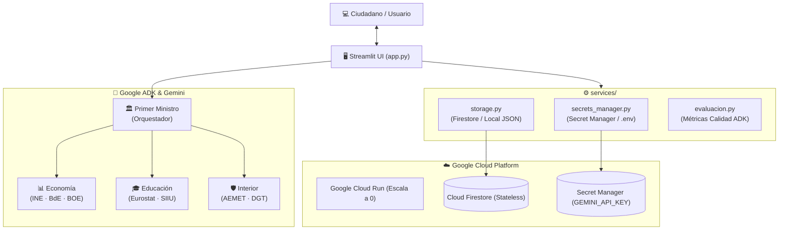

# 🏛️ Partido Tecnocrático de España: Plataforma de Gobernanza Multiagente

Propuesta política y de gobernanza para España basada en **Google Agent Development Kit (ADK)**, **Gemini**, análisis empírico, ciencia de datos y optimización de recursos públicos en **Google Cloud Platform (GCP)** con **coste 0,00 € (Always Free Tier)**.

---

## 📐 Arquitectura del Sistema



---

## 📂 Estructura del Repositorio

```text
tecnocracia/
├── .github/workflows/
│   ├── ci.yml                     # CI: Linter, tests unitarios y Docker dry-run
│   └── cd-cloud-run.yml           # CD: Despliegue continuo a Google Cloud Run
├── data/
│   └── datos_comunidad.json       # Persistencia local JSON (autocreado si no existe)
├── primer_ministro/               # Orquestador del gabinete (Google ADK)
│   ├── agent.py                   # Agente coordinador y delegación a ministros
│   ├── eval_set_1.evalset.json    # Evaluaciones multi-turno de fidelidad
│   ├── evals_primer_ministro.json # Casos de test ADK
│   └── test_prime_minister.ipynb  # Notebook interactivo de simulación
├── ministros/                     # Subagentes especializados con Grounding oficial
│   ├── economia.py                # Ministro de Economía (INE, BdE, BOE)
│   ├── educacion.py               # Ministra de Educación (Educabase, Eurostat, SIIU)
│   ├── interior.py                # Ministro de Interior (AEMET, DGT, Interior)
│   └── aborto.evalset.json        # Dataset de evaluación temática
├── services/                      # Servicios centrales desacoplados
│   ├── __init__.py                # Exportación limpia de la API
│   ├── storage.py                 # Persistencia dual (Cloud Firestore / JSON Local)
│   ├── secrets_manager.py         # Google Secret Manager y fallback .env
│   └── evaluacion.py              # Motor de evaluación y scoring ADK
├── scripts/                       # Automatización y aprovisionamiento
│   ├── deploy_gcp.sh              # Despliegue en 1 clic (Bash / Linux / macOS)
│   └── deploy_gcp.ps1             # Despliegue en 1 clic (PowerShell / Windows)
├── tests/                         # Batería de pruebas automatizadas (100% offline)
│   ├── test_agents.py             # Estructura y herramientas de ministros
│   ├── test_app.py                # Pruebas de lógica de app y evaluación
│   └── test_adk_evals.py          # Validación de datasets y resiliencia
├── cloud_functions/               # Microservicio serverless (Google Cloud Functions Gen 2)
│   └── consultar_gabinete/        # Endpoint HTTP con CORS para integración externa
├── app.py                         # Aplicación Web Streamlit (UI, Métricas, Trazabilidad)
├── Dockerfile                     # Contenedor optimizado para Cloud Run
├── cloudbuild.yaml                # Pipeline nativo Google Cloud Build
├── requirements.txt               # Dependencias unificadas del proyecto
└── README.md
```

---

## 🚀 Despliegue en 1 Clic (Google Cloud Run)

Los scripts en [`scripts/`](file:///c:/Users/adri/Desktop/tecnocracia/scripts) aprovisionan automáticamente Firestore, Secret Manager, cuentas de servicio IAM y despliegan en **Cloud Run con escalado a cero**.

#### 🪟 En Windows (PowerShell):
```powershell
.\scripts\deploy_gcp.ps1 -ProjectId "TU_PROJECT_ID" -Region "europe-west1"
```

#### 🐧 En Linux / macOS / Cloud Shell (Bash):
```bash
chmod +x scripts/deploy_gcp.sh
./scripts/deploy_gcp.sh TU_PROJECT_ID europe-west1
```

---

## 🛡️ Garantía de Coste Cero (GCP Always Free Tier)

La infraestructura está configurada para mantenerse estrictamente dentro de las cuotas perpetuamente gratuitas de Google Cloud:

| Servicio | Límite Gratuito Mensual | Configuración en Tecnocracia |
| :--- | :--- | :--- |
| **Cloud Run** | 2.000.000 peticiones / 360.000 GB-s | `--min-instances 0` (0 servidores encendidos en reposo = 0,00 €) |
| **Firestore** | 1 GiB disco · 50.000 lecturas/día | Modo Nativo para votos, buzón ciudadano e historial |
| **Secret Manager** | 6 versiones activas / 10.000 operaciones | Cifrado seguro de `GEMINI_API_KEY` sin coste |
| **Cloud Build** | 120 minutos de compilación al día | Construcción de contenedores en despliegues |
| **GitHub Actions** | 2.000 min/mes (ilimitado en públicos) | CI/CD automático ante cada `push` |

---

## 💻 Ejecución Local y Pruebas

```bash
# 1. Crear entorno y activar
python -m venv .venv
.venv\Scripts\activate      # En Windows
# source .venv/bin/activate # En Linux / macOS

# 2. Instalar dependencias
pip install -r requirements.txt

# 3. Configurar API Key en .env
echo GEMINI_API_KEY="tu_clave_aqui" > .env

# 4. Lanzar la aplicación
streamlit run app.py

# 5. Ejecutar la batería de pruebas automatizadas
python -m unittest discover -s tests -v
```

---

## ⚙️ CI/CD Continuo con GitHub Actions

Para que GitHub Actions despliegue automáticamente en cada `git push`:
1. Ve a **Settings > Secrets and variables > Actions** en tu repositorio de GitHub.
2. Añade `GCP_PROJECT_ID`, `GEMINI_API_KEY` y `GCP_SA_KEY` (clave JSON de la Service Account).
3. Cada commit ejecutará linter, pruebas y construirá el contenedor sin tiempo de inactividad.
